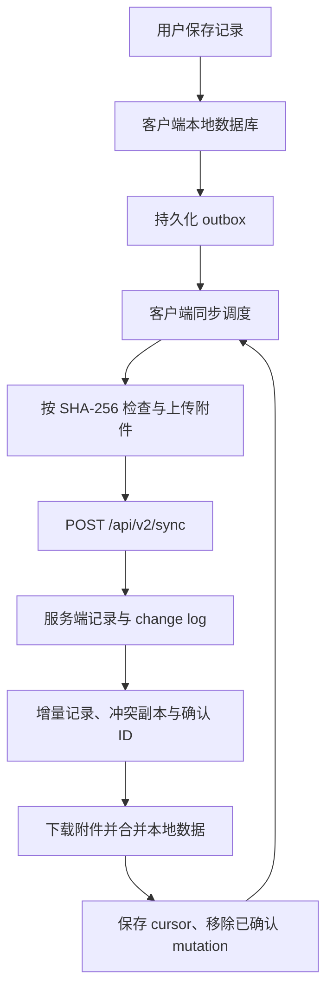

# 应用架构与目录边界

此刻是本地优先的日记应用。手机负责随时捕捉，桌面负责键盘输入和宽屏整理；两个客户端独立维护界面与本地存储，通过版本化协议交换记录和附件。

## 模块边界

| 模块 | 当前实现 | 主要职责 |
| --- | --- | --- |
| `mobile/` | Flutter / Dart，Android 为主要适配平台 | 对话式速记、编辑、媒体、回看和设备能力 |
| `desktop/` | Electron + React，Windows x64 | 多栏工作区、快捷键、速记窗口、整理与检索 |
| `server/` | Node.js，JSON 文件与附件目录 | 幂等 mutation、增量 change log、冲突副本、附件与更新接口 |
| `docs/` | 数据与交互约定 | 架构、协议、开发与部署说明 |

两端共享字段和业务语义，平台界面由各自实现。Flutter 中其他平台工程的存在不代表已完成与 Android 相同的适配；Windows 桌面入口在 `desktop/`。

## 本地数据

移动端页面通过控制器和 `DiaryRepository` 完成读写。Android 原生仓储使用 Isar Community，保存记录、草稿、outbox 和同步状态；Web 仓储使用 SharedPreferences fallback，完整平台能力需要独立验证。

桌面端由 Electron main 进程持有 SQLite 连接，使用 WAL、事务和 FTS5。renderer 经 preload 暴露的业务 IPC 读写数据，开启 `contextIsolation`、关闭 `nodeIntegration`。正式记录、草稿、设置、outbox 和 cursor 保存在 `diary.sqlite` 中；旧版 `localStorage` 仅作为迁移输入，迁移前保存恢复副本，浏览器预览仍有 fallback。

媒体导入后存入客户端自己的受管目录，不依赖原文件继续存在。设备上的文件路径属于本地数据，跨端传输时转为稳定附件 ID 和 `asset://<sha256><扩展名>` 引用。

## 同步数据流

本地保存不等待网络。失败的工作保留在 outbox 中，只有成功应用远端变更并确认 mutation 后，客户端才推进 cursor 和清理对应队列。

Android 自动同步由 `DeferredSyncQueue` 合并唤醒：交互停顿约 2 秒后开始，单轮上传和拉取各最多 20 条；自动执行失败或仍有工作时默认约 10 秒后继续调度。历史附件元数据在待上传记录和远端分页追平后按每页 10 条补齐。手动同步通过 `flush()` 立即执行并连续处理剩余正常批次，失败时结束本轮并等待重试。文件哈希和大文件上传分别使用后台计算与流式读取，避免发送消息时集中处理全部历史记录。

上述数值属于当前移动端调度实现。桌面端使用自己的同步调度，两端均遵循 v2 的幂等、游标和附件约定。

## 记录版本、冲突与删除

- `id` 是跨端记录主键，`mutationId` 标识一次修改；重发同一个 mutation 不重复应用。
- 普通版本按 `(updatedAt, deviceId, mutationId)` 比较。v2 中未胜出的修改保存为冲突副本，供客户端查看与处理。
- 移入回收站使用 `deletedAt`，客户端仍可恢复；永久删除发送 `isDeleted: true` 的 tombstone。服务端保留删除状态，防止旧设备重新上传同 ID 的普通记录。
- 冲突处理保存新的主记录修改，同时标记本地冲突状态。当前服务端没有专用的冲突解决接口，也不会自动将对应冲突副本在所有设备上标记为已处理。
- `/api/v1/sync` 保留兼容入口；升级后的手机端和桌面端使用 `/api/v2/sync`。

字段与响应格式见[同步协议](sync-contract.md)。新增字段应保持兼容，改变既有字段语义时需要明确的协议版本与迁移方案。

## 附件与服务存储

正文同步和二进制传输分开。客户端通过 `HEAD` 检查 SHA-256 是否存在，用 `PUT` 上传原始字节，用 `GET` 下载；单文件上限为 128 MiB。服务端写入临时文件、校验大小与哈希，再原子改名。

服务端的记录、mutation 和 change log 保存到 `SYNC_DATA_FILE`，附件保存在同级 `assets/`。写操作在单进程中排队，并通过临时文件替换 JSON。当前存储面向单进程运行，不允许多个实例同时写入同一数据文件；后续替换存储时需保留协议语义。

## 备份与更新

客户端 ZIP 备份包含记录和本机可用附件。桌面端启动初始化后会在后台生成每日滚动备份，每个 UTC 日期最多一份，保留最近 7 份。服务端备份则需要同时保存记录文件和附件目录；同步会传播编辑与删除，应另行保留备份副本。

更新检查使用公开的 `/api/v1/update` 与下载接口，更新清单在请求时读取。客户端当前提供手动检查和打开下载链接，不会自动替换已安装应用。Android 更新应使用同一签名并覆盖安装，保留原有数据。

当前日记和备份未加密，应用密码用于访问控制。公网同步应配置 HTTPS 和访问令牌，部署步骤见[服务器部署说明](server-sync-service-deployment.md)。
